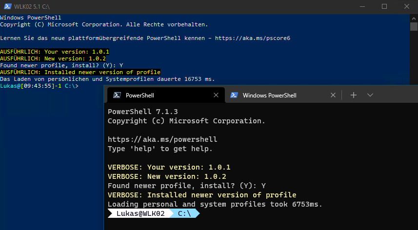

# Meine PowerShell Profile
Dieses Repository dient meinen öffentlich zugänglichen User-Profilen.

Installation: `iex $(irm https://raw.githubusercontent.com/LukasKurthRocks/MyUserProfiles/main/install.ps1)`\
Installation: `iex $((iwr https://raw.githubusercontent.com/LukasKurthRocks/MyUserProfiles/main/install.ps1).Content)`

\
Die Zeiten sind nur so hoch, weil ich nicht sofort mit Y bestätigt habe.

## Anmerkung
Das funktioniert für das PowerShell Profil, weil ich Scripts die ich eventuell benötige in Module oder einen Sub-Ordner packen kann.
Für Windows Terminal funktioniert das nicht, da ich hier private oder geschäftliche Verbindungen und Daten mit einbinden muss.

Außerdem wollte ich WinGet Settings mit rein nehmen, aber seit Version 1.0 sind die experimentellen Settings - die ich mit der Settings Datei aktivieren wollte - alle implementiert/aktiviert worden. Hat daher keine Verwendung hier.

Ein paar Sachen zur "frischen Installation" (VS-Settings, WindowsTerminal Settings/Profile etc.) muss ich daher in ein privates Repo packen.

Zum Schluss noch ein Tipp: Man kann der Verknüpfung von PowerShell und den Profilen im WindowsTerminal "-NoProfile" mitgeben, dann wird der StartBlock nicht mit angezeigt. Ist bei mir immer so eingestellt, da ich das bei häufiger Verwendung schon was nervig finde.

## Pfade
Verschiedene Instanzen von PowerShell haben verschiedene Profil-Pfade.

| Profil             | Pfad           |
| ------------------ | -------------- |
| Windows PowerShell | `$HOME\Documents\PowerShell\Microsoft.PowerShell_profile.ps1` |
| PowerShell         | `$HOME\Documents\WindowsPowerShell\Microsoft.PowerShell_profile.ps1` |
| ISE                | `$HOME\Documents\WindowsPowerShell\Microsoft.PowerShellISE_profile.ps1` |
| VS Code            | `$HOME\Documents\PowerShell\Microsoft.VSCode_profile.ps1` |

## Vorraussetzungen
Die Sachen hier packe ich so nicht in das Profil mit rein (vielleicht als Kommentar). Einmal installiert braucht diese Abfrage wieder keiner.

- Schriftarten
    - [Delugia.Nerd.Font.ttf](https://github.com/adam7/delugia-code/releases/latest/download/Delugia.Nerd.Font.ttf "Download Font from GitHub")
    - [Delugia.Nerd.Font.Complete.ttf](https://github.com/adam7/delugia-code/releases/latest/download/Delugia.Nerd.Font.Complete.ttf "Download Font from GitHub")
- Module
    - Install-Module posh-git -Scope CurrentUser
    - Install-Module oh-my-posh -Scope CurrentUser
- PowerShell Core (wenn gewünscht)
    - OneLiner: `iex "& { $(irm https://aka.ms/install-powershell.ps1) } -UseMSI"`

OneLiner:\
`iwr https://github.com/adam7/delugia-code/releases/latest/download/Delugia.Nerd.Font.ttf -O "$env:windir\Fonts\Delugia.Nerd.Font.ttf"; iwr https://github.com/adam7/delugia-code/releases/latest/download/Delugia.Nerd.Font.Complete.ttf -O "$env:windir\Fonts\Delugia.Nerd.Font.Complete.ttf"; Install-Module posh-git, oh-my-posh -Scope CurrentUser`

## Testing
Hinweise:

- https://devblogs.microsoft.com/powershell/optimizing-your-profile/
    - https://www.powershellgallery.com/packages/PSProfiler
        - Measure-Script

## TODO
Aktuelle Aufgaben
- [ ] Verschiedene PS1 Profil Namen? Da gab es mal ein Problem, schau ich später.